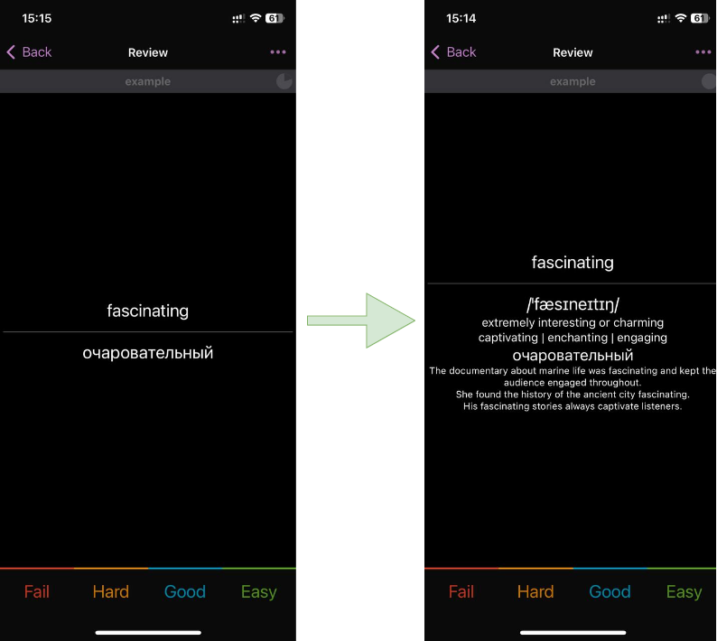

# Overview

Anki is a powerful tool for spaced repetition learning, but it takes time to prepare high-quality decks. You often face a choice: use high-quality community decks (which rarely align perfectly with your needs), create fast but awkward decks on your own, or invest a lot of time in preparing better decks.
This tool allows you to leverage the power of Large Language Models (LLMs) to transform fast deck drafts into precise and high-quality cards. 

# Compatibility

This tool works both with AnkiApp iOS proprietary file format and csv (most common in other apps). Support if APKG is not implemeted, but can be done in days, just ping me in the Telegramm (@arabel1a).

# Who Would Benefit from This Tool
For example, I used it this way:
*Imagine you are a native Russian speaker and you are learning English. While reading English books, you draft cards in Anki. Whenever a new word appears, you log it in the app with a short translation. After weeks, when your collection grows to 500 cards. Now, you want more than just translations - you want transcription, English definition, usage examples, and more. Looking up each word in the dictionary would take forever. This tool completes the task in minutes at a cost of less than $0.002 per card*

If you want to enhance a deck on a different subject, you likely only need to modify the user prompt (see below). In most cases, the rest of the pipeline should work without modifications. At the very least, this repository provides a solid starting point.

# Pipeline Example

1. **Export your deck:** In AnkiApp, click your Deck -> Options -> Export. Put this file into the `decks` directory.
2. **(Optional) Update user prompt:** There is a pre-prepared prompt for the example above. If you need another deck fields, please modify the `utils.USERPROMPT`.
3. **Run the `example.ipynb`:** This is an interactive Jupyter Notebook, if you don't have Jupyter - see https://jupyter.org/install
4. **Enter API key:** You can modify the API key and other parameters in the 3rd cell of example.ipynb
5. **Click Run -> Run All**
6. **Import enhanced deck:** Enhanced deck in AnkiApp format can be found in `decks`, csv decks are in `csv` directory.
7. **Enjoy the learning process** Revisit your cards at least once a day and soon you will notice the improvement.
